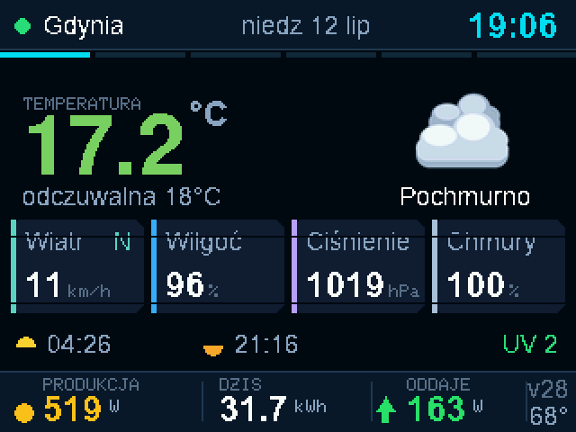

# Weather + Huawei SUN2000 Wall Display

[](https://github.com/premiumads-pl/Weather-huawei-sun2000/actions/workflows/build.yml)
[](LICENSE)

*[Polska wersja tego README](README.pl.md)*

A wall-mounted ESP32-S3 display that shows the weather, your Huawei solar
inverter's live output, a rain radar, and planes flying over the bay — no
buttons, no app, updates itself over Wi-Fi.




## Why this exists

This started as a weather clock and grew into a small home dashboard: it
polls a weather API, talks Modbus TCP to a solar inverter, decodes radar
tiles, and tracks nearby air traffic — all on a $5 microcontroller with no
PSRAM and a screen buffer that has to fight the network stack for every
free byte of RAM. If you like squeezing embedded systems until they beg for
mercy, this repo has some fun corners for you (see [Known
limitations](#known-limitations) and the [issue tracker](../../issues)).

## Features

The board has no buttons — everything rotates automatically (every 9 s,
15 s for the flight map) with slide transitions and animated charts. A
fixed top bar (city, date, clock, Wi-Fi status) and a fixed bottom bar
(today's PV yield / export) are always visible.

| # | Screen | Shows |
|---|--------|-------|
| 0 | **Now** | current temperature, condition icon, "feels like", wind + direction, humidity, pressure, cloud cover, sunrise/sunset, UV index |
| 1 | **Hours** | 12-hour temperature curve (gradient fill), precipitation bars, icons every 2 h |
| 2 | **5 days** | vertical min–max range bars, condition icons, precipitation bars |
| 3 | **PV** | instantaneous power, inverter load gauge, today's production profile, today/house/grid/inverter-temperature |
| 4 | **Flights** | map of the Gdańsk Bay (Hel–Tricity) with live aircraft; green = landing at Gdańsk, orange = departing Gdańsk (via [adsb.fi](https://adsb.fi)) |
| 5 | **Stats** | device diagnostics: subsystem health, heap, CPU temperature, uptime, Wi-Fi RSSI |

Other things it does:

- **Rain radar** — real radar imagery from RainViewer overlaid on screen 0's
  priority logic (a forecast model can miss a local downpour; radar can't).
- **RGB status LED** — green = exporting to the grid, blue = balanced
  (± 300 W), red = importing from the grid. Runs a 3-color self-test on
  boot so you can confirm the LED wiring/mapping is correct.
- **Alerts** — storm, heavy rain, high wind, frost, heat, and inverter-fault
  conditions interrupt the rotation with a full-screen warning.
- **Night mode** — backlight dims (PWM) between 22:00 and 06:00.

## Remote diagnostics

The device hangs on a wall with no USB cable attached, so a few JSON/HTTP
endpoints stand in for a serial console (all also reachable from the
"Diagnostics" tab of the web panel):

| Endpoint | Returns |
|---|---|
| `GET /api/log` | in-RAM ring buffer of the last ~120 log lines |
| `GET /api/diag` | JSON snapshot: heap (current/min-ever/largest free block), Wi-Fi RSSI, per-subsystem last-success age and last error, OTA status |
| `GET /api/view?i=N` | pins screen `N` (`0`–`5`); `i=-1` returns to auto-rotation; responds with `{"cur":X,"pin":Y}` |
| `GET /api/screen` | current screen as a 320×240 24-bit BMP (~1 s to fetch) |
| `POST /api/reboot` | restarts without touching saved configuration |

`/api/view` and `/api/screen` together are also how the screenshots and GIF
on this page were generated — see
[`tools/capture_screens.py`](tools/capture_screens.py).

## Hardware / BOM

| Part | Notes |
|------|-------|
| **ESP32-S3 Super Mini** | 4 MB flash, **no PSRAM** — this matters, see [Known limitations](#known-limitations) |
| **ST7789 2.8" IPS TFT, 240×320** | driven in landscape (320×240, rotation 1) |
| USB-C cable | for the first flash only; everything after that is OTA |

### Wiring

Pin-out is defined in [`User_Setup.h`](User_Setup.h) (a TFT_eSPI
configuration file — see [Flashing](#flashing) for where it needs to go).

| Signal | ESP32-S3 GPIO | Notes |
|--------|:---:|-------|
| MOSI | 11 | HSPI |
| SCLK | 12 | HSPI |
| CS | 10 | |
| DC | 8 | |
| RST | 9 | |
| BL (backlight) | 14 | PWM, dimmed at night |
| MISO | *not connected* | `TFT_MISO -1` — display is write-only, no read-back |
| VCC | 3V3 | |
| GND | GND | |

Panel driver: `ST7789_DRIVER`, SPI bus: `HSPI` @ 27 MHz, colour order:
`TFT_BGR`, `TFT_INVERSION_OFF`. If your panel shows inverted or
wrong-hued colors, those last two are the first things to flip.

## Flashing

### Option A — build from source with `arduino-cli`

```bash
# 1. TFT_eSPI needs this repo's display config instead of its own default:
cp User_Setup.h "$(arduino-cli lib list TFT_eSPI --format json \
  | python3 -c 'import json,sys; print(json.load(sys.stdin)["installed_libraries"][0]["library"]["install_dir"])')/User_Setup.h"

# 2. Compile (min_spiffs partitions are required — see below)
arduino-cli compile \
  --fqbn "esp32:esp32:esp32s3:CDCOnBoot=cdc,PartitionScheme=min_spiffs" .

# 3. Flash over USB
arduino-cli upload -p /dev/cu.usbmodem101 \
  --fqbn "esp32:esp32:esp32s3:CDCOnBoot=cdc,PartitionScheme=min_spiffs" .
```

Requirements: `arduino-cli`, esp32 board core (`esp32:esp32`, this repo's CI
pins **3.3.10**), and the libraries `TFT_eSPI`, `ArduinoJson`, `PNGdec` and `PubSubClient`.

**`PartitionScheme=min_spiffs` is not optional.** It gives two ~1.9 MB app
partitions; the default partition table's app slot is too small for OTA to
have a second copy to write into, so remote updates would simply fail.

### Option B — flash a pre-built release with `esptool`

Every [GitHub Release](../../releases) ships a ready-to-flash
`firmware.bin`. This is the **application partition only** (an OTA-style
image), so it has to be written to an ESP32-S3 that already has a
bootloader and partition table on it — e.g. a board that was flashed at
least once with option A, or with any other Arduino/ESP-IDF sketch using
the same `min_spiffs` partition layout.

```bash
pip install esptool
esptool.py --chip esp32s3 -p /dev/cu.usbmodem101 write_flash 0x10000 firmware.bin
```

### Option C — flash from the browser (planned)

[ESP Web Tools](https://esphome.github.io/esp-web-tools/) would let anyone
flash a blank board from Chrome/Edge with one click, no CLI required. It's
not wired up yet — see
[the tracking issue](../../issues) for why (short version: a true
"flash from scratch" needs the bootloader + partition table images
published as release assets too, not just the app binary that
`tools/release.sh` currently uploads). Contributions welcome.

## Configuration — no secrets in the repo, ever

There is **no** Wi-Fi password, IP address, or API key anywhere in this
source tree. Everything lives in the device's NVS flash and is set through
a web panel:

1. On first boot (or after a Wi-Fi reset) the device creates an access
   point named **`Pogoda-Setup`**. Its name/password and IP are shown on
   the screen.
2. Connect to it from a phone and open `http://192.168.4.1`.
3. In the panel:
   - **Scan for networks** → pick yours → enter the password.
   - **Location** → type a city name → pick from the list (Open-Meteo
     geocoder).
   - **Inverter** → Modbus TCP IP address (the one FusionSolar shows you)
     and the plant's peak power in kWp.
4. Once connected, the same panel stays reachable on your home network at
   the device's IP (also shown on the boot screen).

This configuration survives OTA updates and power loss. None of it — SSID,
password, coordinates, inverter IP — is ever committed to git or baked into
`firmware.bin`.

### Updates (OTA)

The device polls
`releases/latest/download/version.json` every 15 minutes. If the version
number is higher than the one it's running, it downloads `firmware.bin`,
writes it to the inactive OTA partition, and reboots — with a progress bar
on screen. Maintainers publish a new version with `tools/release.sh
"what changed"` (bumps `Version.h`, compiles, enforces the RAM ceiling
below, tags, and creates the Release).

## MQTT / Home Assistant

Optional, **off by default**. Turn it on in the web panel under
**MQTT / Home Assistant**: broker address, port (default `1883`), optional
username/password, and a topic prefix (default `pogoda-gdynia`). The broker
password is stored in NVS and is never returned by `/api/state` — the panel only
sees a "password is set" flag.

Once the device connects, it publishes Home Assistant MQTT Discovery configs
(retained, on `homeassistant/sensor/<device-id>/<entity>/config`) **once per
connection**, and they all share one `device` block — so Home Assistant shows a
single device with 22 entities rather than 22 loose ones:

| Group | Entities |
|-------|----------|
| **PV** | AC power, DC power, energy today (`total_increasing`), lifetime energy, grid balance (positive = exporting, negative = importing), house load, inverter temperature, inverter status |
| **Weather** | temperature, apparent temperature, humidity, pressure, wind, cloud cover, UV index, precipitation (mm/h), condition |
| **Device** (diagnostic) | ESP32 temperature, free heap, uptime, Wi-Fi RSSI, firmware version |

States are grouped into one retained JSON per topic (`<prefix>/pv/state`,
`<prefix>/wx/state`, `<prefix>/dev/state`) and picked apart with
`value_template`, which keeps the packet count low: PV every 30 s, weather every
15 min, device telemetry every 60 s.

Availability uses `<prefix>/status` (`online` / `offline`, retained) with an MQTT
Last Will, so Home Assistant marks the entities unavailable if the display drops
off the network.

If the broker is unreachable the device keeps working normally — connection
attempts use short timeouts and back off from 5 s to 5 min, and the failure is
reported on the on-device stats screen and in `GET /api/diag`.

Same settings from the serial console:

```
mqtt <host> [port]        # sets the broker and enables publishing
mqtt off
mqttauth <user> <pass>    # pass "-" clears the password
mqttprefix <prefix>
```

## Compatibility

**Inverter:** Huawei SUN2000 series over **Modbus TCP, port 502**
(register set: `32064/32080/32106/32114/32016/32086/32087/32089/37100/37113`
— DC/AC/grid power, daily/total energy, PV voltage, inverter temperature,
efficiency, status code, meter status). Other Huawei SUN2000 models that
expose the same register map should work; other brands will not, since the
Modbus client (`PvClient`) currently talks to this one register layout
directly rather than through an abstraction (see
[open issues](../../issues) if you'd like to help generalize this).

Two quirks worth knowing before you file a bug:

- **The inverter accepts exactly one Modbus TCP session at a time.** If you
  point another client (a script on your laptop, Home Assistant, etc.) at
  it while the display is running, one of the two will get disconnected.
- **It can take up to ~100 s to respond after it powers on** (e.g. at
  sunrise, or after a grid outage) — the display treats "inverter offline"
  as normal during that window rather than raising an alert immediately.

**Weather:** [Open-Meteo](https://open-meteo.com) — free, no API key.
Note it's a forecast *model*, not radar, so it can miss a very local
downpour; that's why the rain radar (RainViewer) takes priority on screen 0
when the two disagree.

**Flights:** [adsb.fi](https://adsb.fi) (ADS-B + MLAT aggregator, free,
no key) plus route lookups from `vrs-standing-data`.

## Repository layout

```
pogoda-gdynia.ino    setup()/loop(), Wi-Fi + FreeRTOS task wiring, alerts
Config.h              pins, timings, tunables (no secrets)
Settings.h/.cpp       NVS-backed config (Wi-Fi, location, inverter) + PV history
Portal.h/.cpp         captive portal + web panel + JSON API + serial console
WeatherClient.h/.cpp, WeatherData.h    Open-Meteo fetch + parsed model
PvClient.h/.cpp, PvData.h              Huawei SUN2000 Modbus TCP client + parsed model
RadarClient.h/.cpp    RainViewer tile fetch + PNG decode + pixel sampling
FlightClient.h/.cpp, FlightData.h      adsb.fi fetch + route cache
MapData.h             generated coastline outline for the flight map
WeatherUi.h/.cpp       all TFT_eSPI drawing (6 screens, header/footer, alerts)
Led.h/.cpp             RGB status LED
Ota.h/.cpp             GitHub-Releases-based OTA client
Log.h/.cpp             in-RAM log ring buffer for /api/log
tools/release.sh       version bump + build + RAM gate + tag + GitHub Release
tools/capture_screens.py  screenshot capture used to generate docs/ images
```

## Contributing

Bug reports, hardware variations, and pull requests are welcome — see
[CONTRIBUTING.md](CONTRIBUTING.md) for the build/test workflow and the
project's one hard rule (no secrets in the repo). Check the
[open issues](../../issues) for a prioritized backlog, including a few
tagged [`good first issue`](../../issues?q=is%3Aissue+is%3Aopen+label%3A%22good+first+issue%22).

## Known limitations

- **No PSRAM, ~320 KB total RAM, and a screen buffer that eats most of
  it.** Free heap has been observed as low as ~1 KB under load (TLS +
  JSON parsing at the same time); see `GET /api/diag` on a running device.
  There's a safety net (OTA frees the screen buffer and retries if heap is
  critically low) but it's a genuinely tight fit, not a comfortable one.
- **RainViewer only serves zoom ≤ 7** for the tile endpoint this project
  uses; zoom 8+ returns a "Zoom Level Not Supported" placeholder tile whose
  anti-aliased text can look like a false radar echo if you don't know to
  expect it. Don't raise the zoom without re-verifying this.
- **The Huawei inverter allows only one Modbus TCP client.** See
  [Compatibility](#compatibility).
- **Open-Meteo is a forecast model, not a measurement** — it can miss a
  local storm entirely.
- **PNGdec needs one contiguous ~46 KB heap block to decode a radar
  tile**, on a heap that fragments down to ~34 KB free-contiguous under
  load; the radar client asks the UI to temporarily release the screen
  buffer while it decodes, which briefly freezes (not blanks) the display.

## License

[MIT](LICENSE) © 2026 Maciej
