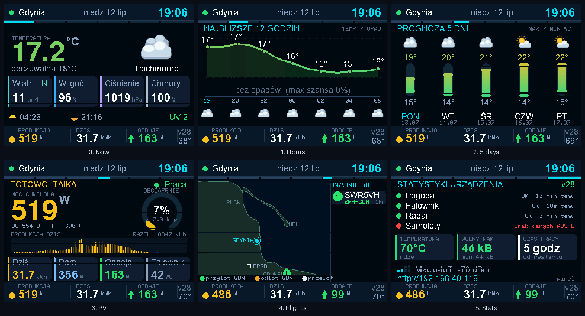

*[English version of this README](README.md)*

# Pogoda + Fotowoltaika Huawei SUN2000

Wyświetlacz ścienny na ESP32-S3 + ST7789 (320×240, landscape). Pokazuje prognozę
pogody z Open-Meteo, dane z falownika Huawei SUN2000 przez Modbus TCP oraz mapę
samolotów nad Zatoką Gdańską (ADS-B).

Płytka nie ma przycisków — wszystko przełącza się automatycznie.



## Ekrany

Rotacja co 9 s (mapa lotów: 15 s), przejścia slide, animowane wykresy.
Stała belka górna (miasto, data, zegar, WiFi) i stały pasek PV na dole.

| # | Ekran | Zawartość |
|---|-------|-----------|
| 1 | **TERAZ** | wielka temperatura, ikona, odczuwalna, wiatr + kierunek, wilgotność, ciśnienie, zachmurzenie, wschód/zachód, UV |
| 2 | **GODZINY** | krzywa temperatury na 12 h (gradient), słupki opadów, ikony co 2 h |
| 3 | **5 DNI** | pionowe słupki zakresu min–max, ikony, paski opadów |
| 4 | **PV** | moc chwilowa, wskaźnik obciążenia instalacji, profil produkcji dnia, dziś / dom / sieć / temperatura falownika |
| 5 | **SAMOLOTY** | mapa Zatoki (Hel–Trójmiasto) + lista lotów; zielony = ląduje w Gdańsku, pomarańczowy = startuje z Gdańska |
| 6 | **STATYSTYKI** | diagnostyka urządzenia: stan podsystemów, RAM, temperatura CPU, czas pracy, Wi-Fi |

**Alerty** (burza, ulewa, silny wiatr, mróz, upał, awaria falownika) przerywają
rotację i wyświetlają ostrzeżenie.

**Tryb nocny** — PWM na podświetleniu, przygaszenie 22:00–06:00.

**Dioda RGB** — zielony = oddaję do sieci, niebieski = równowaga (±300 W),
czerwony = pobieram z sieci. Autotest kolorów przy starcie.

## Konfiguracja — bez sekretów w kodzie

W repozytorium **nie ma** żadnych haseł, adresów IP ani kluczy. Wszystko siedzi
w pamięci NVS urządzenia i ustawia się przez panel WWW.

1. Po pierwszym uruchomieniu urządzenie tworzy sieć **`Pogoda-Setup`**
   (hasło `pogoda123`). Nazwa sieci i adres są pokazane na ekranie.
2. Połącz się telefonem i otwórz `http://192.168.4.1`.
3. W panelu:
   - **Wyszukaj sieci bezprzewodowe** → wybierz swoją → wpisz hasło
   - **Lokalizacja** → wpisz miasto → wybierz z listy (geokoder Open-Meteo)
   - **Falownik** → adres IP (Modbus TCP) i moc szczytowa instalacji w kWp
4. Po połączeniu panel zostaje dostępny w sieci domowej pod adresem IP
   urządzenia (widocznym na ekranie startowym).

Konfiguracja przeżywa aktualizacje OTA i zanik zasilania.

## Aktualizacje OTA

Urządzenie co 15 minut sprawdza
`releases/latest/download/version.json`. Jeśli numer wersji jest wyższy niż
wkompilowany, pobiera `firmware.bin`, zapisuje go na partycji OTA i restartuje
się. Na ekranie widać pasek postępu.

Publikacja nowej wersji:

```bash
./tools/release.sh "co się zmieniło"
```

Skrypt podnosi `FW_VERSION`, kompiluje, wymusza barierę RAM (patrz
`CONTRIBUTING.md`), commituje, taguje i tworzy Release z `firmware.bin` +
`version.json`.

## Sprzęt

| Sygnał | GPIO |
|--------|------|
| CS  | 10 |
| DC  | 8  |
| RST | 9  |
| MOSI| 11 |
| SCLK| 12 |
| BL  | 14 (PWM) |
| MISO| — |

ESP32-S3 Super Mini (4 MB flash, **2 MB PSRAM (trzeba włączyć opcją `PSRAM=enabled`)**), ST7789 240×320 używany w
landscape 320×240, SPI 27 MHz (HSPI), TFT_eSPI.

## Budowanie

Wymagane: `arduino-cli`, rdzeń `esp32:esp32` (CI trzyma się `3.3.10`), oraz
biblioteki `TFT_eSPI`, `ArduinoJson` i `PNGdec` (dekoder PNG kafelków radaru).

Skopiuj `User_Setup.h` z tego repo do katalogu biblioteki TFT_eSPI
(nadpisuje domyślną konfigurację — sterownik, piny, `TFT_BGR`, `TFT_INVERSION_OFF`).

```bash
arduino-cli compile \
  --fqbn "esp32:esp32:esp32s3:CDCOnBoot=cdc,PartitionScheme=min_spiffs,PSRAM=enabled" .

arduino-cli upload -p /dev/cu.usbmodem101 \
  --fqbn "esp32:esp32:esp32s3:CDCOnBoot=cdc,PartitionScheme=min_spiffs,PSRAM=enabled" .
```

Partycje `min_spiffs` są konieczne — dają dwie partycje aplikacji po 1,9 MB,
bez tego OTA się nie zmieści.

To dokładnie ta sama komenda, którą uruchamia `tools/release.sh` i CI, więc
odtwarza opublikowany `firmware.bin` co do bajtu. Celowo nie ma tu żadnych
dodatkowych `--build-property` do zapamiętania: jedyna flaga kompilatora, którą
ten projekt nadpisuje (`-fno-exceptions`, warta ~95 kB flasha), siedzi w pliku
`build_opt.h` w tym katalogu, a rdzeń esp32 podnosi go sam. Nie kasuj tego pliku
— wyjaśnienie w [CONTRIBUTING.md](CONTRIBUTING.md#build_opth--dont-delete-it-its-worth-95-kb-of-flash).

Zobacz też [README.md](README.md) (EN) — sekcja *Flashing* opisuje dodatkowo
flashowanie gotowego `firmware.bin` przez `esptool`.

## Falownik — dwie rzeczy, o których warto wiedzieć

- **Huawei SUN2000 przyjmuje tylko jedną sesję Modbus TCP naraz.** Równoległy
  klient (skrypt na komputerze, Home Assistant...) rozłączy wyświetlacz.
- **Po starcie (np. o wschodzie słońca) potrafi nie odpowiadać nawet przez
  ~100 s** — wyświetlacz traktuje to jako normalny stan rozruchu, a nie
  od razu jako awarię.

## Źródła danych

- **Pogoda** — [Open-Meteo](https://open-meteo.com) (bez klucza)
- **Geokoder** — Open-Meteo Geocoding API
- **Fotowoltaika** — Huawei SUN2000, Modbus TCP :502
  (rejestry 32064/32080/32106/32114/32016/32086/32087/32089/37100/37113)
- **Samoloty** — [adsb.fi](https://adsb.fi) (ADS-B + MLAT) i trasy z
  vrs-standing-data

## Zdalna diagnostyka

Urządzenie wisi na ścianie bez USB, więc `Serial` jest ślepy. Zamiast tego:

- `GET /api/log` — bufor kołowy ostatnich ~120 linii logu
- `GET /api/diag` — migawka JSON: heap, Wi-Fi, ostatni sukces/błąd każdego
  podsystemu, status OTA
- `GET /api/view?i=N` — przypina ekran (0–5, `-1` = powrót do rotacji)
- `GET /api/screen` — bieżący ekran jako BMP 320×240 24-bit
- `POST /api/reboot` — restart bez kasowania konfiguracji

Wszystko to jest też podpięte pod zakładkę „Diagnostyka” w panelu WWW.

## Konsola serwisowa

Przez USB (115200):

```
wifi <ssid> <haslo>
loc <nazwa> <lat> <lon>
modbus <ip>
peak <W>
show
reset          # kasuje zapisane WiFi
```

## Współpraca

Zgłoszenia błędów i pull requesty mile widziane — zobacz
[CONTRIBUTING.md](CONTRIBUTING.md) oraz [Issues](../../issues). Kilka spraw
oznaczonych jest jako [`good first issue`](../../issues?q=is%3Aissue+is%3Aopen+label%3A%22good+first+issue%22).

## Znane ograniczenia

- **Brak PSRAM, bardzo ciasny RAM** — wolny heap bywa niski w praktyce
  (obserwowane ~1 kB pod obciążeniem TLS+JSON). Zobacz `GET /api/diag`.
- **RainViewer obsługuje tylko zoom ≤ 7.** Od 8 w górę zwraca kafelek z napisem
  „Zoom Level Not Supported" — antyaliasowany tekst wygląda w danych jak echo opadu.
  Nie podnosić zoomu bez ponownej weryfikacji.
- **Falownik Huawei przyjmuje tylko jedną sesję Modbus TCP.**
- **Open-Meteo to model, nie radar** — potrafi kompletnie przegapić lokalną ulewę. Dlatego
  ekran 1 ma priorytet: radar > prognoza.

## Licencja

[MIT](LICENSE) © 2026 Maciej
