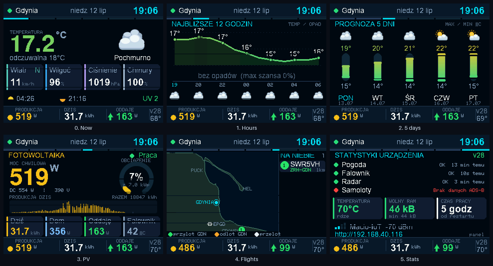

*[English version of this README](README.md)*

# Pogoda + Fotowoltaika Huawei SUN2000

Wyświetlacz ścienny na ESP32-S3 + ST7789 (320×240, landscape). Pokazuje prognozę
pogody z Open-Meteo, dane z falownika Huawei SUN2000 przez Modbus TCP oraz mapę
samolotów nad Zatoką Gdańską (ADS-B).

Płytka nie ma przycisków — wszystko przełącza się automatycznie.



## Ekrany

Rotacja co 9 s (mapa lotów: 15 s), przejścia slide, animowane wykresy.
Stała belka górna (miasto, data, zegar, WiFi) i stały pasek PV na dole.

| # | Ekran | Zawartość |
|---|-------|-----------|
| 1 | **TERAZ** | wielka temperatura, ikona, odczuwalna, wiatr + kierunek, wilgotność, ciśnienie, zachmurzenie, wschód/zachód, UV |
| 2 | **GODZINY** | krzywa temperatury na 12 h (gradient), słupki opadów, ikony co 2 h |
| 3 | **5 DNI** | pionowe słupki zakresu min–max, ikony, paski opadów |
| 4 | **PV** | moc chwilowa, wskaźnik obciążenia instalacji, profil produkcji dnia, dziś / dom / sieć / temperatura falownika |
| 5 | **SAMOLOTY** | mapa Zatoki (Hel–Trójmiasto) + lista lotów; zielony = ląduje w Gdańsku, pomarańczowy = startuje z Gdańska |
| 6 | **STATYSTYKI** | diagnostyka urządzenia: stan podsystemów, RAM, temperatura CPU, czas pracy, Wi-Fi |

**Alerty** (burza, ulewa, silny wiatr, mróz, upał, awaria falownika) przerywają
rotację i wyświetlają ostrzeżenie.

**Tryb nocny** — PWM na podświetleniu, przygaszenie 22:00–06:00.

**Dioda RGB** — zielony = oddaję do sieci, niebieski = równowaga (±300 W),
czerwony = pobieram z sieci. Autotest kolorów przy starcie.

## Konfiguracja — bez sekretów w kodzie

W repozytorium **nie ma** żadnych haseł, adresów IP ani kluczy. Wszystko siedzi
w pamięci NVS urządzenia i ustawia się przez panel WWW.

1. Po pierwszym uruchomieniu urządzenie tworzy sieć **`Pogoda-Setup`**
   (hasło jest indywidualne dla każdego urządzenia). Nazwa sieci, hasło i adres
   są pokazane na ekranie.
2. Połącz się telefonem i otwórz `http://192.168.4.1`.
3. W panelu:
   - **Wyszukaj sieci bezprzewodowe** → wybierz swoją → wpisz hasło
   - **Lokalizacja** → wpisz miasto → wybierz z listy (geokoder Open-Meteo)
   - **Falownik** → adres IP (Modbus TCP) i moc szczytowa instalacji w kWp
4. Po połączeniu panel zostaje dostępny w sieci domowej pod adresem IP
   urządzenia (widocznym na ekranie startowym).

Konfiguracja przeżywa aktualizacje OTA i zanik zasilania.

## Aktualizacje OTA

Urządzenie co 15 minut sprawdza
`releases/latest/download/version.json`. Jeśli numer wersji jest wyższy niż
wkompilowany, pobiera `firmware.bin`, zapisuje go na partycji OTA i restartuje
się. Na ekranie widać pasek postępu.

Publikacja nowej wersji:

```bash
./tools/release.sh "co się zmieniło"
```

Skrypt podnosi `FW_VERSION`, kompiluje, wymusza barierę RAM (patrz
`CONTRIBUTING.md`), commituje, taguje i tworzy Release z `firmware.bin` +
`version.json`.

## Sprzęt

| Sygnał | GPIO |
|--------|------|
| CS  | 10 |
| DC  | 8  |
| RST | 9  |
| MOSI| 11 |
| SCLK| 12 |
| BL  | 14 (PWM) |
| MISO| — |

ESP32-S3 Super Mini (4 MB flash, **2 MB PSRAM (trzeba włączyć opcją `PSRAM=enabled`)**), ST7789 240×320 używany w
landscape 320×240, SPI 27 MHz (HSPI), TFT_eSPI.

## Budowanie

Wymagane: `arduino-cli`, rdzeń `esp32:esp32` (CI trzyma się `3.3.10`), oraz
biblioteki `TFT_eSPI`, `ArduinoJson`, `PNGdec` (dekoder PNG kafelków radaru),
`PubSubClient` (MQTT) oraz `JPEGENC` (zrzuty ekranu przez panel WWW).

Skopiuj `User_Setup.h` z tego repo do katalogu biblioteki TFT_eSPI
(nadpisuje domyślną konfigurację — sterownik, piny, `TFT_BGR`, `TFT_INVERSION_OFF`).

```bash
arduino-cli compile \
  --fqbn "esp32:esp32:esp32s3:CDCOnBoot=cdc,PartitionScheme=custom,PSRAM=enabled" .

arduino-cli upload -p /dev/cu.usbmodem101 \
  --fqbn "esp32:esp32:esp32s3:CDCOnBoot=cdc,PartitionScheme=custom,PSRAM=enabled" .
```

`PartitionScheme=custom` jest konieczne — podnosi własną tablicę partycji tego
repo ([`partitions.csv`](partitions.csv): NVS 148 kB oraz dwie partycje
aplikacji po 1920 kB, bez SPIFFS), bez tego OTA się nie zmieści.

To dokładnie ta sama komenda, którą uruchamia `tools/release.sh` i CI, więc
odtwarza opublikowany `firmware.bin` co do bajtu. Celowo nie ma tu żadnych
dodatkowych `--build-property` do zapamiętania: jedyna flaga kompilatora, którą
ten projekt nadpisuje (`-fno-exceptions`, warta ~95 kB flasha), siedzi w pliku
`build_opt.h` w tym katalogu, a rdzeń esp32 podnosi go sam. Nie kasuj tego pliku
— wyjaśnienie w [CONTRIBUTING.md](CONTRIBUTING.md#build_opth--dont-delete-it-its-worth-95-kb-of-flash).

Zobacz też [README.md](README.md) (EN) — sekcja *Flashing* opisuje dodatkowo
flashowanie gotowego `firmware.bin` przez `esptool`.

## Falownik — dwie rzeczy, o których warto wiedzieć

- **Huawei SUN2000 przyjmuje tylko jedną sesję Modbus TCP naraz.** Równoległy
  klient (skrypt na komputerze, Home Assistant...) rozłączy wyświetlacz.
- **Po starcie (np. o wschodzie słońca) potrafi nie odpowiadać nawet przez
  ~100 s** — wyświetlacz traktuje to jako normalny stan rozruchu, a nie
  od razu jako awarię.

## Źródła danych

- **Pogoda** — [Open-Meteo](https://open-meteo.com) (bez klucza)
- **Geokoder** — Open-Meteo Geocoding API
- **Fotowoltaika** — Huawei SUN2000, Modbus TCP :502
  (rejestry 32064/32080/32106/32114/32016/32086/32087/32089/37100/37113)
- **Samoloty** — [adsb.fi](https://adsb.fi) (ADS-B + MLAT) i trasy z
  vrs-standing-data

## Zdalna diagnostyka

Urządzenie wisi na ścianie bez USB, więc `Serial` jest ślepy. Zamiast tego:

- `GET /api/log` — bufor kołowy ostatnich ~120 linii logu
- `GET /api/diag` — migawka JSON: heap, Wi-Fi, ostatni sukces/błąd każdego
  podsystemu, status OTA
- `GET /api/view` — odczyt bieżącego widoku `{"cur":X,"pin":Y}` (tylko odczyt)
- `POST /api/view?i=N` — przypina ekran (0–14, `-1` = powrót do rotacji); od v154 mutacja
  wymaga POST, żeby obca strona nie przestawiła ekranu przez ``.
  Numery pochodzą **wyłącznie** ze stałych `cfg::VIEW_*` w `Config.h` — nie z tej listy.
  **v181: `i=12` to od tego wydania ekran ZWROT (zwrot z fotowoltaiki), AUTO przesunęło
  się na `i=13`, a STATYSTYKI na `i=14`.** Nowy ekran musi wchodzić przed `VIEW_STATS`, bo
  `static_assert` wymaga, żeby ekran serwisowy był ostatni — pełne uzasadnienie stoi
  w `Config.h`.
- `GET /api/screen` — bieżący ekran jako BMP 320×240 24-bit
- `POST /api/reboot` — restart bez kasowania konfiguracji

Wszystko to jest też podpięte pod zakładkę „Diagnostyka” w panelu WWW.

## Konsola serwisowa

Przez USB (115200):

```
wifi <ssid> <haslo>
loc <nazwa> <lat> <lon>
modbus <ip>
peak <W>
show
reset          # kasuje zapisane WiFi
```

## Współpraca

Zgłoszenia błędów i pull requesty mile widziane — zobacz
[CONTRIBUTING.md](CONTRIBUTING.md) oraz [Issues](../../issues). Kilka spraw
oznaczonych jest jako [`good first issue`](../../issues?q=is%3Aissue+is%3Aopen+label%3A%22good+first+issue%22).

## MQTT / Home Assistant

Opcjonalne, **domyślnie wyłączone**. Włącza się w panelu WWW w sekcji
**MQTT / Home Assistant**: adres brokera, port (domyślnie `1883`), opcjonalny
użytkownik i hasło oraz prefiks tematów (domyślnie `pogoda-gdynia`). Hasło do
brokera siedzi w NVS i **nigdy** nie wraca przez `/api/state`: panel dostaje
wyłącznie flagę „hasło jest ustawione".

Po połączeniu urządzenie publikuje konfiguracje MQTT Discovery (retained, na
`homeassistant/sensor/<device-id>/<encja>/config`) **raz na połączenie**, wszystkie
ze wspólnym blokiem `device`. Dzięki temu w Home Assistancie widać jedno
urządzenie z 22 encjami, a nie 22 luźne encje.

| Grupa | Encje |
|---|---|
| **PV** | moc AC, moc DC, produkcja dzisiaj (`total_increasing`), produkcja całkowita, bilans sieci (dodatni = oddaję, ujemny = pobieram), pobór domu, temperatura falownika, status falownika |
| **Pogoda** | temperatura, temperatura odczuwalna, wilgotność, ciśnienie, wiatr, zachmurzenie, indeks UV, opad (mm/h), stan pogody |
| **Urządzenie** (diagnostyka) | temperatura ESP32, wolna sterta, czas pracy, RSSI Wi-Fi, wersja firmware |

Stany idą zgrupowane, po jednym retained JSON-ie na temat (`<prefiks>/pv/state`,
`<prefiks>/wx/state`, `<prefiks>/dev/state`), a rozbiera je `value_template` po
stronie HA. To trzyma liczbę pakietów nisko: PV co 30 s, pogoda co 15 min,
telemetria urządzenia co 60 s.

Dostępność jedzie przez `<prefiks>/status` (`online` / `offline`, retained) z
Last Will, więc gdy wyświetlacz zniknie z sieci, HA oznacza encje jako niedostępne.

### Jedyny temat, który urządzenie SUBSKRYBUJE (od v174)

`<prefiks>/auto/stan` to stan auta (Tesla), publikowany przez Home Assistanta
mniej więcej co 15 s i rysowany na ekranie **AUTO** (`/api/view?i=12`). To jedyny
temat przychodzący, subskrypcja jest odtwarzana po każdym reconnekcie. Ładunek to
jeden płaski obiekt JSON, wszystkie pola wymagane, jeśli nie zaznaczono inaczej:

```json
{"soc":95,"km":389,"kw":2.5,"a":4,"kwh":13.5,"tryb":"PV",
 "stan":"laduje","kabel":1,"limit":100,"sl":2.6,"si":10.9}
```

`soc` procent baterii, `km` zasięg, `kw` moc ładowania, `a` żądany prąd (A),
`kwh` energia dodana w tej sesji, `tryb` dokładnie jedna z wartości `OFF`, `PV`,
`PV+MIN`, `MAX` (kolor kafelka trybu jest kontraktem z pierścieniem WLED w
garażu), `stan` jedna z `laduje` / `czeka` / `stoi` / `spi` / `brak` (ASCII
celowo, to pole techniczne, wyświetlacz sam mapuje je na polski), `kabel` 0/1
czy kabel wpięty, `limit` docelowy procent naładowania, `sl` / `si` kWh oddane
dziś do auta ze słońca i z sieci.

Wiadomość, której nie da się sparsować albo w której brakuje `soc`, `tryb` lub
`stan`, jest odrzucana w całości i na ekranie zostaje poprzedni stan. Jeśli przez
45 s (2,5 × kadencja 15 s) nic nie przyjdzie, ekran AUTO wypada z rotacji. Nadal
da się go przypiąć z panelu i wtedy sam o tym mówi.

Gdy broker jest nieosiągalny, urządzenie pracuje normalnie: próby połączenia mają
krótkie timeouty i backoff od 5 s do 5 min, a awarię widać na ekranie statystyk
i w `GET /api/diag`.

Te same ustawienia z konsoli szeregowej:

```
mqtt <host> [port]        # ustawia brokera i włącza publikowanie
mqtt off
mqttauth <user> <pass>    # "-" jako hasło czyści hasło
mqttprefix <prefiks>
```

## Znane ograniczenia

- **Ciasny RAM wewnętrzny (~320 kB) i twardy budżet 76 000 B RAM statycznego.**
  Płytka MA 2 MB PSRAM, zmierzone na żywym urządzeniu (`GET /api/diag` zwraca
  `"psram": 2097152`), i to tam siedzą bufor ekranu oraz klatki radaru. Ciasno
  jest w SRAM-ie wewnętrznym: wolny heap bywa niski w praktyce (obserwowane
  ~1 kB pod obciążeniem TLS+JSON). Zobacz `GET /api/diag`.
- **RainViewer obsługuje tylko zoom ≤ 7.** Od 8 w górę zwraca kafelek z napisem
  „Zoom Level Not Supported" — antyaliasowany tekst wygląda w danych jak echo opadu.
  Nie podnosić zoomu bez ponownej weryfikacji.
- **Falownik Huawei przyjmuje tylko jedną sesję Modbus TCP.**
- **Open-Meteo to model, nie radar** — potrafi kompletnie przegapić lokalną ulewę. Dlatego
  ekran 1 ma priorytet: radar > prognoza.

## Licencja

[MIT](LICENSE) © 2026 Maciej
